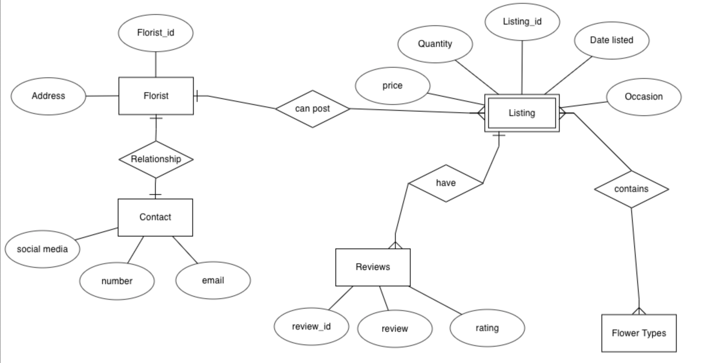
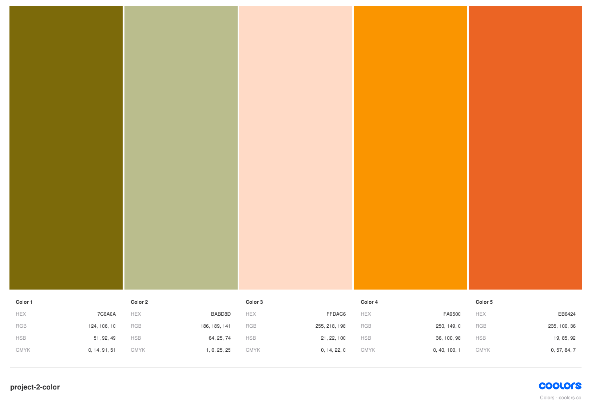
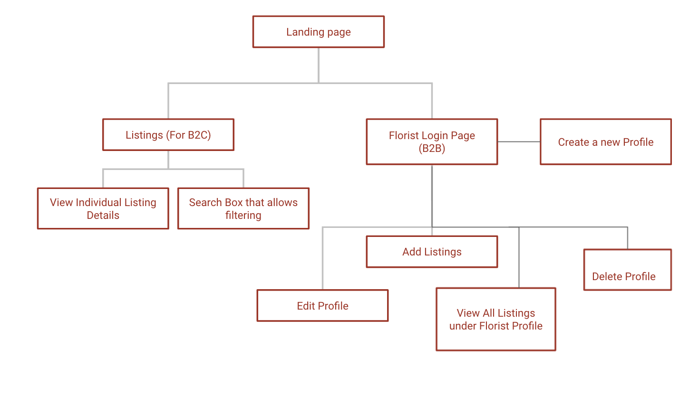

# Index:

1. Summary of project
2. UX/UI 
3. Comprehensive Feature List 
4. Structure of Website
5. Technologies Used
6. Testing Steps
7. Future Features Implementation / Bugs
8. Credits

## 1. Summary of Project

Welcome to the Floral Market Place!

A centralised platform where the public can find affordable and unique bouquets or flower arrangements for various occasions by freelance florists listing their flower arrangements/bouquets.

URL of website: https://agitated-pike-b66fc1.netlify.app/

## 1A. Users, User Goals (User Story and Acceptance Criteria)

**B2C: Individuals age from 18 - 40 years old and anyone who shops online**

User Story: Often users have to google for "Where to get flowers in Singapore" but search results often only who already or relative know florists in Singapore. Usually their bouqets are more pricey and flower arrangment can be quite ordinary.

Acceptance Criteria: Therefore, through this site, users can view these freelance / homebase florists and search for listings of more unique floral arrangements which can meet their budget.

**Market Segments**

Age 18 - 25 : Young adults getting bouquets for graduation / dates at an affordable price as they may not be working.

Age 25 to 40 : Working Adults who want to get unique bouquets / flower arrangements for gifting and or formal occasions such as anniversary, weddings etc.

**B2B: Freelance / Homebase Florists**

User Story: For small florist business owners, it may be difficult for them to reach out to more audience and it is also difficult to compete with already known offline/online florists.

Acceptance Criteria: This site aims to help these freelance/homebase florists by allowing them to list and publicise their products and social media pages.

## 1B. Site Owner Goals

**Short term goal:**

A platform to link up to B2B users to B2C users, creating more convenience and opprtunities for both sides.

Bringing customers to small business owners to help them grow their customer base.

**Long term goal:**

Eventually be able to monetise it and make it a subscription basis listing for B2B users. B2B users may choose the number of posts they want to list a month and pay for a small subscription fee.

## 2. UX/UI (Five Planes of UI/UX)

## 2A. Strategy

**User: Anyone who shops online age 18-25. B2C (Business to Customer)**

User Needs: Find affordable graduation bouquets

User Pain Points: Bouquets in relative known offline shops might be pricey for a non-working adult

Goal: Website shows various freelance or homebase florists' listings which can be more afforable and value for money

**User: Anyone who shops online age 25-40. B2C (Business to Customer)**

User Needs: Find unique flower arrangements

User Pain Points: Bouquets in relative known offline shops too ordinary or default

Goal: Website shows various freelance or homebase florists' listings of more unique flower arrangements

**User: Freelance / Homebase Florists. B2C (Business to Customer)**

User Needs: Publicise their small business to more audience

User Pain Points: Difficult to find a suitable platform / hard to compete with other well known offline and online retail florists

Goal: Website that can bring customer to these small businesses

## 2B. Scope
* Will be discussed in 3. Comprehensive features list.

## 2C. Structure
* Will be discussed under 4. Structure of Website.

## 2D. Skeleton

## 2E. Surface 
* Colors: Colours which give a positive mood and reflects the floral concept of the webpage

* Typography: Google Font 'Lato', sans-serif, 'Libre Baskerville', serif and 'Roboto', sans-serif; An informal font style was applied as the user will be browsing throught the website in a more casual setting (relaxed tone). 
Font 'Libre Baskerville', serif applied only to header for home page.

* Font size: Generally normal font size as it is catered for adults

* Layout: Simple layout, straight to point tabs and buttons where users easily navigate throught the page

* Strategy for achieving mobile responsiveness: Website was built from mobile size (XS) and eventually for Ipad and Laptop display

## 3. Comprehensive Feature List 

**3A. For B2C: Customers looking to purchase bouquets**

1. On the listing page, user can see all the listings in a chronological order (Latest listing to oldest).

2. Clicking on the individual listing, a pop-up modal opens, which will display details of the listing (Such as florist contact information, description of the listing, price, etc.).

3. User can also click on the 'search button' in the listing page, and a dropdown with search filters will display.

4. User can filter by keywords, occasion and/or flower type and search. Listing page refreshed to display according to the filter critera.

**3B. For B2B: Freelance / Homebase Florists**

1. On the Florist Login page, florist can choose to create a new profile or login to their profile if they have created one previously.

2. Users without an existing profile can create one by clicking the 'Create New Profile' button. A create profile form will be loaded and after filling up the required information and submit, a new profile is created.

3. For users with existing profile, they can login to view all the listings they have under their profile.

4. User can edit and delete individual listings.

5. User can edit and delete their profile.

## 4. Structure of Website

**4A. For B2C: Customers looking to purchase bouquets**
1. User arrives at landing page of the website.

2. User can click on the 'listing' tab to bring them the the 'listing' page where they can view all the listings by various florists.

3. In the listing page, user can click on the individual listings which opens a pop up, display information on the florists, price and description.

4. User can also use the search box in the 'listing' page to filter by keyword, occasion and/or flower type for results.

**3B. For B2B: Freelance / Homebase Florists**
1. On the Florist Login page, florist can choose to create a new profile or login to their profile if they have created one previously.

2. Users without an existing profile can create one by clicking the 'Create New Profile' button. A create profile form will be loaded and after filling up the required information and submit, a new profile is created.

3. For users with existing profile, they can login to view all the listings they have under their profile.

4. User can edit and delete individual listings in the 'View All Listings' page.

5. User can edit and delete their profile by clickinh on the 'edit' and 'delete' tabs respectively.

## 5. Technologies Used

1. HTML
-  A markup language which provides the structure of a website to be displayed on web browsers.

2. CSS (Cascading Style Sheet)
-  A style sheet language used for describing the presentation of a document written in this HTML page.

3. JavaScript
- Programming language which creates dynamic behaviour to a webpage. It will execute actions and create interaction between the website and their users.

4. React
- A front-end JavaScript library for building websites with user interface components.

5. MongoDB
- Document-based database platform with easy to apply query language methods.

6. Express
- Unopinionated web framework for Node.js. A middleware for processing incoming requests and sends backs responses.

7. Heroku
- Cloud platform that alows us to host our server.

8. Netlify
- Platform that allows us to host our static browser page.

9. Bootstrap
- CSS Framework for building responsive, mobile-first sites.

10. React Moment
- Custom display dates and times in JavaScript.

11. Axios
- Promise based HTTP client for the browser.

12. React Icons
- Library  which consolidates famous icons libraries such as Font Awesome and Heroicons for website .

13. Google Fonts
- Library which includes free and open source font families.

## 6. Testing Steps

**6A. For B2C User: Customers looking to purchase bouquets**

| Test Case # | Test Case Description | Test Steps| Expected Result | 
|-------------|:---------------------:|----------:|----------------:|
|01.          | View all listings     | User clicks on 'listing' tab| Page displays all listing from newest to oldest|
|02.          | Filter listings       |           |                 |
|02A.         |                       | Keyword search "free"       | Displays all listings with "free" mentioned inside description|
|02B.         |                       | Search by Flower Categories "roses"| Displays all listings with flower type "roses"
|02C.         |                       | Search by Flower Categories "roses" and "hydrangea"| Displays all listings with flower type "roses" or "hydrangea"|
|02D.         |                       | Search by Occasion "birthday"| Displays all listings with occasion "birthday"|
|02E.         |                       | Search by Occasion "birthday" and "date"| Displays all listings with occasion "birthday" or "date"|
|02F.         |                       | Search by keyword "delivery" and Flower Categories "roses"| Displays all listings with description including "delivery" and flower type "roses"|
|02G.         |                       | Search by Flower Categories "gerbera" and occasion "wedding"| Results does not exists. Will display results invalid on page and suggest user to view all listings|

**6B. For B2B User: Freelance / Homebase Florists**

| Test Case # | Test Case Description | Test Steps| Expected Result | 
|-------------|:---------------------:|----------:|----------------:|
|01.          | Create Profile        |           |                 |
|01A.         |                       | User fills in all the fields correctly and no error message displayed| Create Profile form is successfully submitted and user redirected to login page to login|
|01B.         |                       | - User submits empty form   - Form fields not filled   - Form fields filled incorrectly / do not match criteria| Alert user to check form fields again|
|02.          | Florist Login         |           |                 |
|02A.         |                       | Florist keys username and email which exists in the database| Alert successful login|
|02B.         |                       | Florist keys username and email which does not exists / does not match in the database| Alert failed login|
|03.          | Florist Edit profile  |           |                 |
|03A.         |                       | User fills in all the fields correctly in edit profile form and no error message displayed| Alert successfully edit profile|
|03B.         |                       | - User submits empty edit profile form   - edit form fields not filled   - edit form fields filled incorrectly / do not match criteria| Alert user to check form fields again|
|04.          | Florist Delete profile  |           |                 |
|04A.         |                       | User fills in email address which matches what is stored in database| Alert successfully delete profile|
|04B.         |                       | User fills in email address which does not match what is stored in database| Alert user that the email address entered does not match database.|
|05.          | Add New Listing       |           |                 |
|05A.         |                       | User fills in all the add listing form fields correctly and no error message displayed| Listing successfully created and user redirected to view all listings under user profile|
|05B.         |                       | - User submits empty add listing form   - add listing form fields not filled   - add listing form fields filled incorrectly / do not match criteria| Alert user to check through the form fields again |
|06.          | Edit Listing          |           |                 |
|06A.         |                       | User fills in all the edit listing form fields correctly and no error message displayed| Listing successfully edited and user redirected to view all listings under user profile|
|06B.         |                       | - User submits empty edit listing form   - edit listing form fields not filled   - edit listing form fields filled incorrectly / do not match criteria| Alert user to check through the form fields again |
|07.          | Delete Listing          |           |                 |
|07A.         |                       | User fills in email address which matches what is stored in database| Alert successfully delete listing|
|07B.         |                       | User fills in email address which does not match what is stored in database| Alert user that the email address entered does not match database.|

## 7. Future Features Implementation / Bugs
- A page where customers can view by florists and the listings under them.
- Search criteria to include filtering by prices.
- Check for duplicate florist profile / if florist has registered a profile before.
- Allow for B2C users to 'like' or review each listing and have a page which shows reviews

## 8. Credits
All images and content used are for educational purpose.

**Images**
- Home page background image from https://unsplash.com/photos/TtKZyFJ7XC0
- Listing Page background image from https://unsplash.com/photos/P103bmFilDA
- Login Page background from https://unsplash.com/photos/IicyiaPYGGI
- Colour Palette from https://coolors.co/7c6a0a-babd8d-ffdac6-fa9500-eb6424

**Flower Images**
1. From About Flowers
- https://aboutflowers.com.sg/media/catalog/product/cache/1/image/9df78eab33525d08d6e5fb8d27136e95/g/r/grad.jpg
- https://aboutflowers.com.sg/media/catalog/product/cache/1/image/9df78eab33525d08d6e5fb8d27136e95/b/1/b1_3.jpg
- https://aboutflowers.com.sg/media/catalog/product/cache/1/image/9df78eab33525d08d6e5fb8d27136e95/g/_/g_.jpg

2. From Mizu Flowers
- https://cdn.shopify.com/s/files/1/0030/8029/0368/products/cherish_1296x.jpg?v=1627556631
- https://cdn.shopify.com/s/files/1/0030/8029/0368/products/822449497_1296x.jpg?v=1569078161

3. From Pagi Florist
- https://pagiflorist.com/wp-content/uploads/2021/05/f1e18d9a-af09-41b4-9306-24587457368c.jpg
- https://pagiflorist.com/wp-content/uploads/2021/05/f0d1dcb5-4efa-44a4-8a9d-c4747a2e78aa.jpg

4. From Eiga Florist
- https://d2j6dbq0eux0bg.cloudfront.net/images/60338582/2567377774.jpg

5. Carousell (@giftsfromrudo)
- https://media.karousell.com/media/photos/products/2019/09/22/hydrangea_rose_bouquet_1569109073_76ef8c52_progressive.jpg

**Quote**
- Landing page quote “Where flowers bloom, so does hope.” – Lady Bird Johnson

