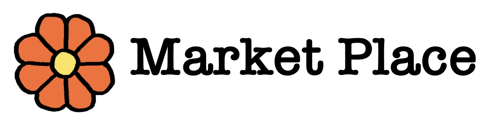

# Index:

1. Summary of project
2. UX/UI 
3. Comprehensive Feature List 
4. Structure of Website
5. Technologies Used
6. Testing Steps
7. Future Features Implementation / Bugs
8. Credits

## 1. Summary of Project

Welcome to the Floral Market Place!

A centralised platform where the public can find affordable and unique bouquets or flower arrangements for various occasions by freelance florists listing their flower arrangements/bouquets.

URL of website: https://agitated-pike-b66fc1.netlify.app/

## 1A. Users, User Goals (User Story and Acceptance Criteria)

**B2C: Individuals age from 18 - 40 years old and anyone who shops online**

User Story: Often users have to google for "Where to get flowers in Singapore" but search results often only who already or relative know florists in Singapore. Usually their bouqets are more pricey and flower arrangment can be quite ordinary.

Acceptance Criteria: Therefore, through this site, users can view these freelance / homebase florists and search for listings of more unique floral arrangements which can meet their budget.

**Market Segments**

Age 18 - 25 : Young adults getting bouquets for graduation / dates at an affordable price as they may not be working.

Age 25 to 40 : Working Adults who want to get unique bouquets / flower arrangements for gifting and or formal occasions such as anniversary, weddings etc.

**B2B: Freelance / Homebase Florists**

User Story: For small florist business owners, it may be difficult for them to reach out to more audience and it is also difficult to compete with already known offline/online florists.

Acceptance Criteria: This site aims to help these freelance/homebase florists by allowing them to list and publicise their products and social media pages.

## 1B. Site Owner Goals

**Short term goal:**

A platform to link up to B2B users to B2C users, creating more convenience and opprtunities for both sides.

Bringing customers to small business owners to help them grow their customer base.

**Long term goal:**

Eventually be able to monetise it and make it a subscription basis listing for B2B users. B2B users may choose the number of posts they want to list a month and pay for a small subscription fee.

## 2. UX/UI (Five Planes of UI/UX)

## 2A. Strategy

**User: Anyone who shops online age 18-25. B2C (Business to Customer)**

User Needs: Find affordable graduation bouquets

User Pain Points: Bouquets in relative known offline shops might be pricey for a non-working adult

Goal: Website shows various freelance or homebase florists' listings which can be more afforable and value for money

**User: Anyone who shops online age 25-40. B2C (Business to Customer)**

User Needs: Find unique flower arrangements

User Pain Points: Bouquets in relative known offline shops too ordinary or default

Goal: Website shows various freelance or homebase florists' listings of more unique flower arrangements

**User: Freelance / Homebase Florists. B2C (Business to Customer)**

User Needs: Publicise their small business to more audience

User Pain Points: Difficult to find a suitable platform / hard to compete with other well known offline and online retail florists

Goal: Website that can bring customer to these small businesses

## 2B. Scope
* Will be discussed in 3. Comprehensive features list.

## 2C. Structure
* Will be discussed under 4. Structure of Website.

## 2D. Skeleton

## 2E. Surface 
* Colors: Colours which are give a positive mood and reflects the floral concept of the webpage

* Typography: Google Font 'Quicksand', sans-serif and 'Roboto', sans-serif. An informal font style was applied as the user will be browsing throught the website in a more casual setting (relaxed tone).

* Font size: Generally normal font size as it is catered for adults

* Layout: Simple layout, straight to point tabs and buttons where users easily navigate throught the page

* Strategy for achieving mobile responsiveness: Website was built from mobile size (XS) and eventually for Ipad and Laptop display

## 8. Credits
- Home page background image from https://unsplash.com/photos/lJKzqr36EoE
- Listing Page background image from https://unsplash.com/photos/P103bmFilDA
